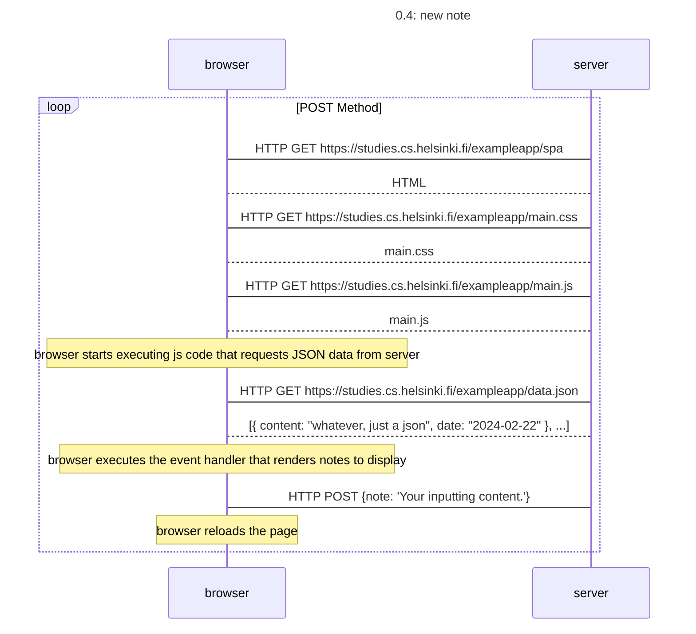

```mermaid
sequenceDiagram
    Title: 0.4: new note

    loop POST Method
        browser->server: HTTP GET https://studies.cs.helsinki.fi/exampleapp/spa
        server-->browser: HTML
        browser->server: HTTP GET https://studies.cs.helsinki.fi/exampleapp/main.css
        server-->browser: main.css
        browser->server: HTTP GET https://studies.cs.helsinki.fi/exampleapp/main.js
        server-->browser: main.js

        note over browser: browser starts executing js code that requests JSON data from server

        browser->server: HTTP GET https://studies.cs.helsinki.fi/exampleapp/data.json
        server-->browser: [{ content: "whatever, just a json", date: "2024-02-22" }, ...]

        note over browser: browser executes the event handler that renders notes to display

        browser->server: HTTP POST {note: 'Your inputting content.'}

        note over browser: browser reloads the page
    end
```

